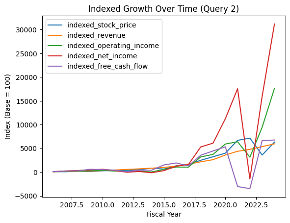
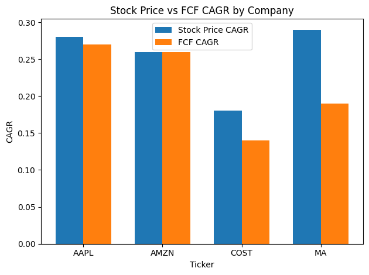

# 📈 Cash Flow - Stock Price vs Fundamentals 📈

## 👋 Welcome  
This is my **SQL analysis** project where hype gets stripped away and only numbers get to talk.

---

## 🚀 Foreword  
This section uses **SQL** to answer a brutal question:  
*What actually drives long-term stock prices—stories, sentiment, or fundamentals?*  

By calculating **CAGR**, building **indexed growth series**, and comparing companies across cycles, this chapter exposes the metric that truly anchors valuation. Spoiler: it’s not revenue. It’s not earnings. It’s **Free Cash Flow.**

---

## 🎯 Objectives  
1. Identify which fundamental metric best tracks stock price long-term.  
2. Compare Amazon’s pattern to other major companies.  
3. Separate short-term noise from long-term signal.

---

## 🛠 Skills and Tools  
- **Language:** SQL  
- **Concepts:** CAGR, indexing, time-series comparison  
- **Skills:** Analytical thinking, financial modeling logic, query design

---

## 📊 Data Overview  

Companies include:
- `Amazon - AMZN`
- `Costco - COST`
- `Mastercard - MA`
- `Apple - AAPL`

Key variables analyzed:
- **Stock Price**
- **Revenue**
- **Operating Income**
- **Net Income**
- **Free Cash Flow (FCF)**

---

## 🔧 Methodology

### 1. CAGR Analysis — Long-Term Truth  
**Question:** Over the full period, which metric grows closest to stock price?  

**Method:**  
- Extract first and last year values  
- Compute CAGR for stock and each fundamental  
- Compare distances  

**Result:**  
> **FCF is the anchor metric explaining Amazon’s long-term stock trajectory.**

---

### 2. Indexed Growth — Shape of the Journey  
**Question:** Which metric visually mirrors the stock over time?  

**Method:**  
- Set base year = 100  
- Index stock and all fundamentals  
- Compare the movements  

**Result:**  
> FCF also explains both long-term direction and medium-term price movements.  
> Narratives determine the short term movement of Amazon.

---

### 3. Cross-Company Test — Is Amazon Special?  
**Question:** Does this pattern hold across other firms?  

**Method:**  
- Join multiple company datasets  
- Run same CAGR logic per ticker  
- Compare price to free cash flow  

**Result:**  
- Long-term: **FCF dominates across companies**  
- Mid-term:  
  - Mature companies → FCF leads stock  
  - Narrative companies → Stock runs ahead of FCF

---

## 🧠 Key Findings  
1. Stock prices ultimately follow **Free Cash Flow** (in the long term), not narratives.  
2. Revenue and earnings matter but they don’t drive valuation alone.  
3. Short term market timing also depends on maturity.

---

## 🎓 Conclusion  

This chapter shows that while markets often respond to stories and narratives, long-term stock prices ultimately follow cash generation. Hype can push prices ahead of fundamentals, but in the long run, stories fade, sentiment shifts, but cash remains the final judge.

---

I hope you enjoyed this one!

Sincerely,  
Julian

